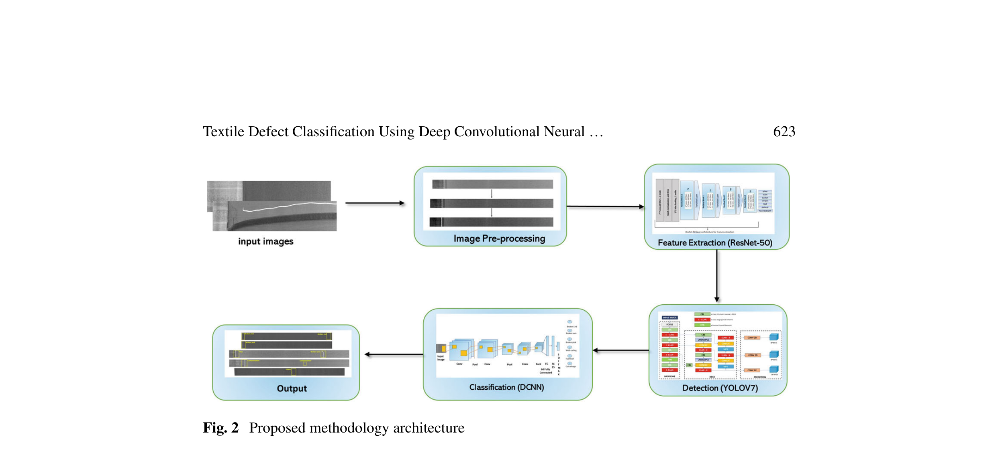
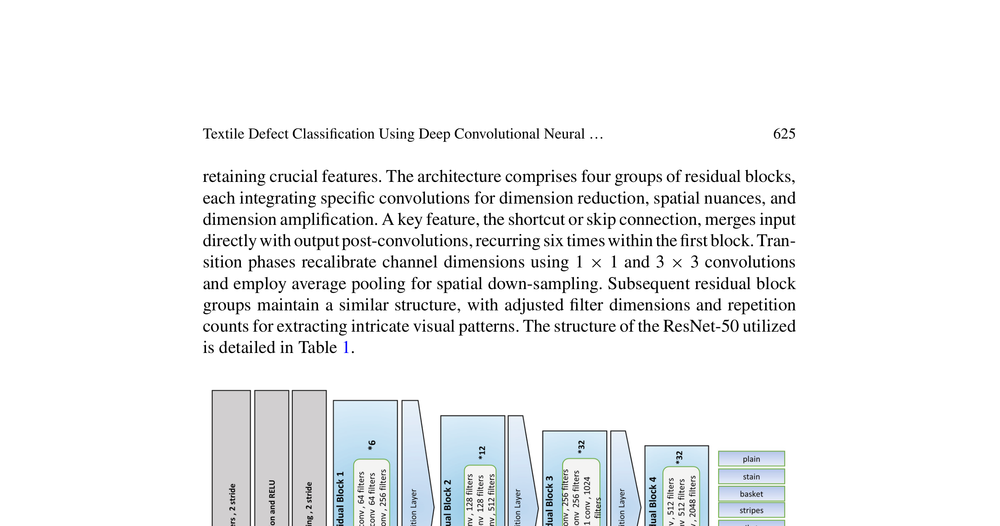
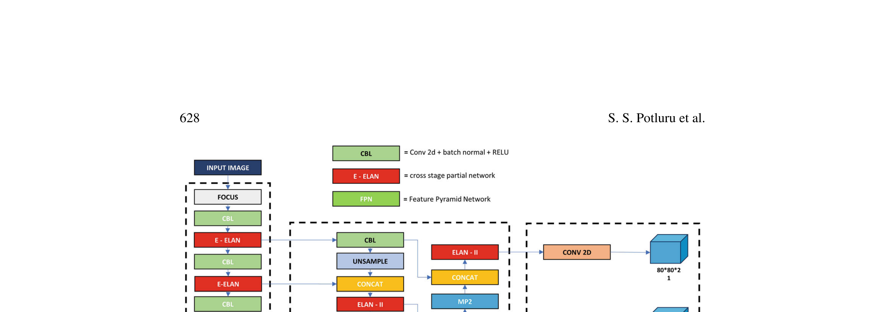
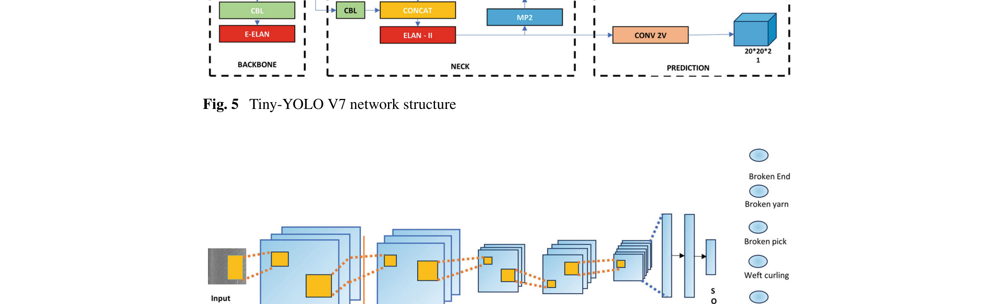
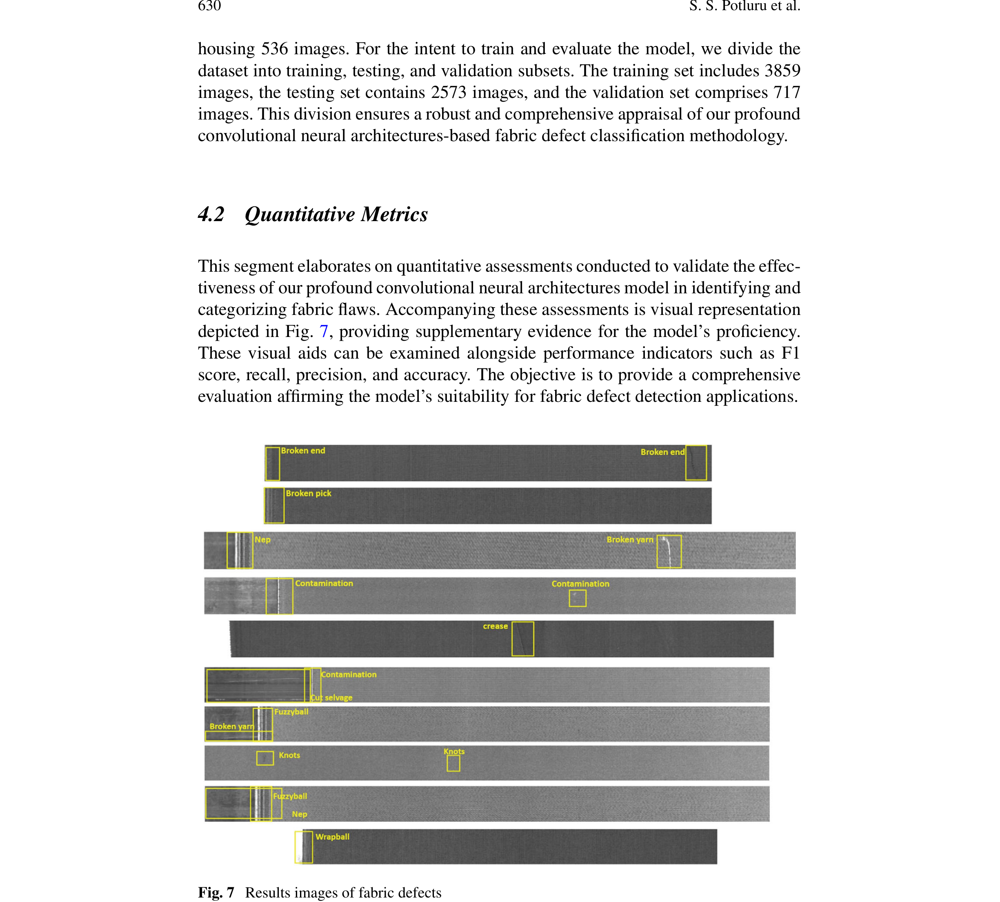
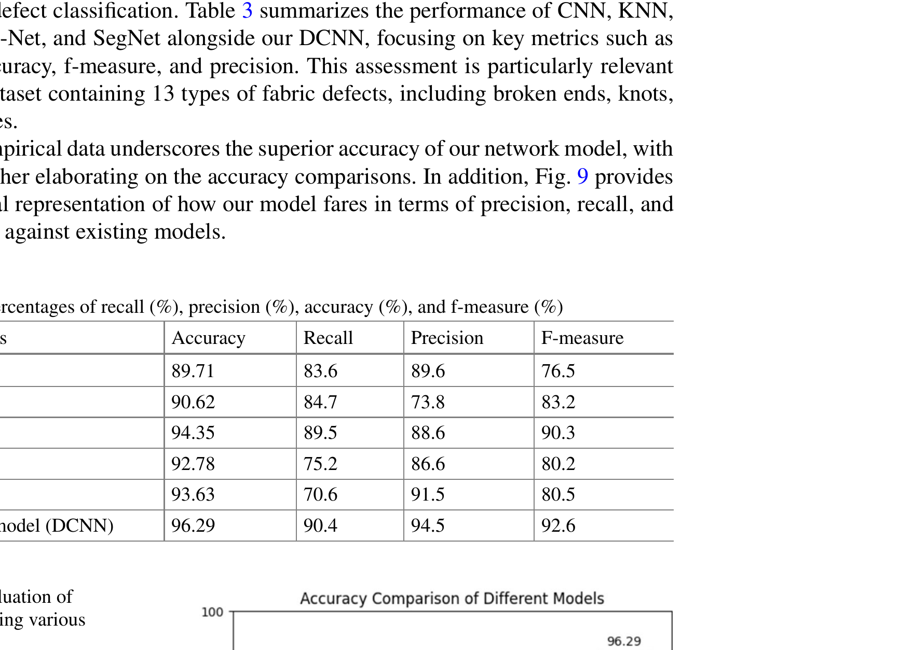
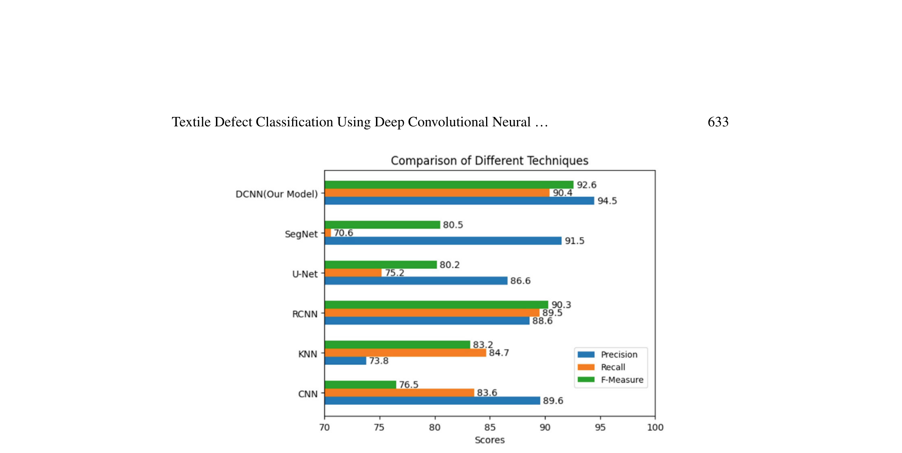
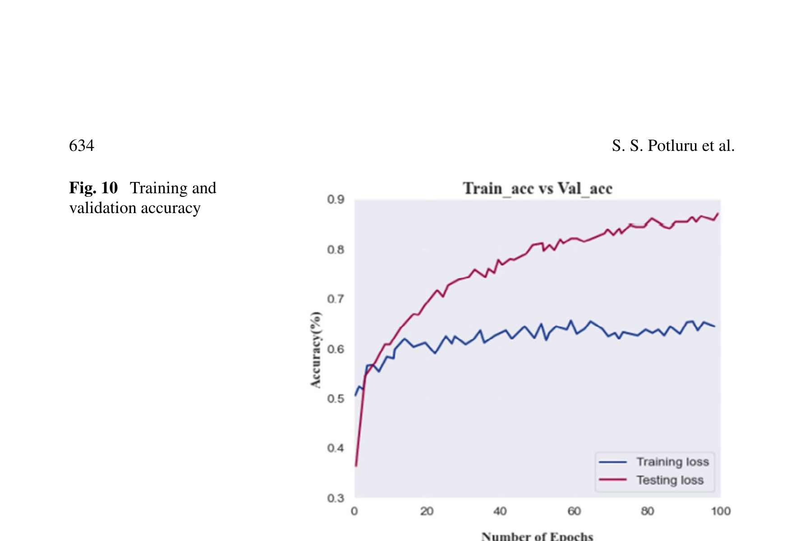
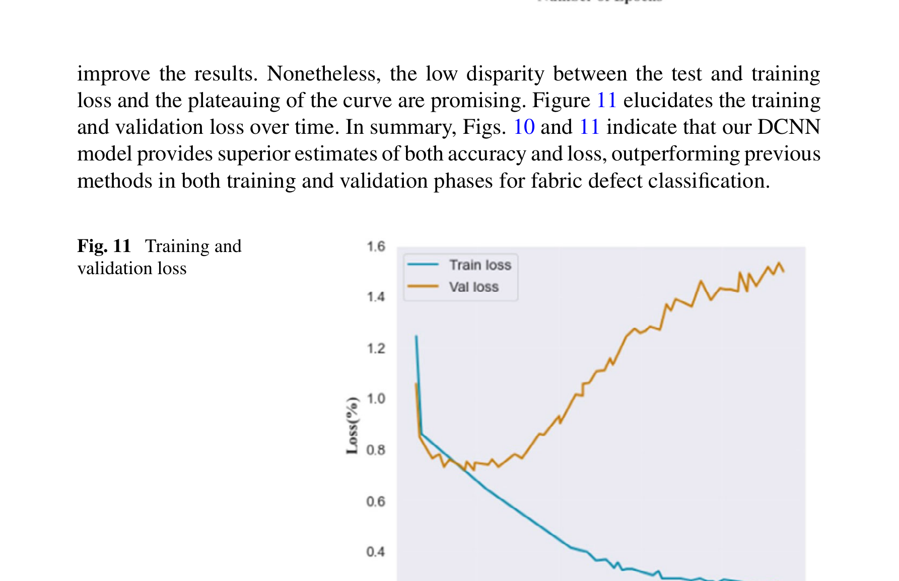

# Textile Defect Classification Using Deep Convolutional Neural Networks (DCNN)

Implementation of the paper *"Textile Defect Classification Using Deep Convolutional Neural Networks (DCNN)"* published in **Springer LNME — Recent Advancements in Product Design and Manufacturing Systems, 2025**.


## Abstract

This research introduces an approach that combines DCNNs with YOLOv7 detection for fabric defect classification. The network architecture includes preprocessing, feature extraction using ResNet-50, defect detection using YOLOv7, and classification using a custom deep convolutional neural network. The system achieves an accuracy of **96.29%** on a dataset of 6,432 fabric images across 12 defect categories.

## Architecture

### Proposed Methodology Pipeline

<p align="center">
  
</p>

*Figure 2: End-to-end pipeline — Input Image → Preprocessing → Feature Extraction (ResNet-50) → Detection (YOLOv7) → Classification (DCNN) → Output*

### ResNet-50 Feature Extraction

<p align="center">
  
</p>

*Figure 4: ResNet-50 architecture used for feature extraction. Four groups of residual blocks with skip connections, processing from 64 to 2048 feature channels.*

**ResNet-50 Structure (Table 1):**

| Layer | Configuration |
|-------|--------------|
| Convolution | 7x7 conv, 64 filters, stride 2 |
| Activation | Batch Normalization + ReLU |
| Pooling | 3x3 max-pool, stride 2 |
| Residual Block 1 | (1x1, 64 → 3x3, 64 → 1x1, 256) x 6 |
| Residual Block 2 | (1x1, 128 → 3x3, 128 → 1x1, 512) x 12 |
| Residual Block 3 | (1x1, 256 → 3x3, 256 → 1x1, 1024) x 18 |
| Residual Block 4 | (1x1, 512 → 3x3, 512 → 1x1, 2048) x 3 |

### YOLOv7-Tiny Detection

<p align="center">
  
</p>

*Figure 5: Tiny-YOLO V7 network structure with E-ELAN backbone, FPN neck, and detection head.*

### Custom DCNN Classifier

<p align="center">
  
</p>

*Figure 6: Proposed dual-track deep convolutional neural network. Track 1: Conv layers with max-pooling for spatial features. Track 2: Dense layers for classification. Input: 150x150x3, Output: 12 defect classes.*

## Defect Categories

The system classifies **12 types** of fabric defects:

| # | Defect Type | # | Defect Type |
|---|-------------|---|-------------|
| 1 | Broken End | 7 | Crease |
| 2 | Broken Yarn | 8 | Warp Ball |
| 3 | Broken Pick | 9 | Knots |
| 4 | Weft Curling | 10 | Contamination |
| 5 | Fuzzy Ball | 11 | Nep |
| 6 | Cut Selvage | 12 | Weft Crack |

## Results

### Performance Comparison (Table 3)

| Method | Accuracy (%) | Recall (%) | Precision (%) | F1-Score (%) |
|--------|-------------|-----------|--------------|-------------|
| CNN | 89.71 | 83.6 | 89.6 | 76.5 |
| KNN | 90.62 | 84.7 | 73.8 | 83.2 |
| RCNN | 94.35 | 89.5 | 88.6 | 90.3 |
| U-Net | 92.78 | 75.2 | 89.6 | 90.2 |
| SegNet | 93.63 | 70.6 | 91.5 | 80.5 |
| **DCNN (Ours)** | **96.29** | **90.4** | **94.5** | **92.6** |

### Detection Results (Figure 7)

<p align="center">
  
</p>

*Figure 7: YOLOv7 detection results on fabric images — bounding boxes localizing broken end, broken yarn, nep, contamination, crease, knots, fuzzy ball, warp ball, and cut selvage defects.*

### Accuracy Comparison

<p align="center">
  
</p>

### Metric-Based Comparison

<p align="center">
  
</p>

### Training Curves

<p align="center">
  
  
</p>

*Left: Training vs validation accuracy over 100 epochs. Right: Training vs validation loss convergence.*

### Computation Time (Table 4)

| Method | Time (seconds) |
|--------|---------------|
| **DCNN (Ours)** | **0.16** |
| U-NET | 0.17 |
| RCNN | 0.18 |
| KNN | 0.19 |
| SEGNET | 0.20 |
| CNN | 0.23 |

## Project Structure

```
textile-defect-classification/
├── src/
│   ├── preprocessing.py        # RGB → Grayscale → Bilateral Filter
│   ├── feature_extraction.py   # ResNet-50 backbone
│   ├── detector.py             # YOLOv7-tiny defect detection
│   ├── dcnn_classifier.py      # Proposed dual-track DCNN
│   ├── dataset.py              # Dataset loading + synthetic data generation
│   ├── train.py                # Training pipeline
│   ├── evaluate.py             # Metrics + comparison plots
│   └── inference.py            # Single-image prediction
├── configs/config.yaml         # Hyperparameters
├── tests/                      # Unit tests
├── docs/                       # Architecture diagrams from paper
├── data/                       # Dataset directory (not in git)
├── checkpoints/                # Saved models (not in git)
├── results/                    # Generated plots and reports
└── requirements.txt
```

## Getting Started

### Prerequisites

- Python 3.10+
- CUDA-compatible GPU (recommended) or Apple Silicon MPS

### Installation

```bash
git clone https://github.com/Sashankpotluru/Textile-Defect-Classification-DCNN.git
cd Textile-Defect-Classification-DCNN

python -m venv .venv
source .venv/bin/activate
pip install -r requirements.txt
```

### Dataset Setup

Organize your dataset in the following structure:
```
data/raw/
├── broken_end/      (536 images)
├── broken_yarn/     (536 images)
├── broken_pick/     (536 images)
├── weft_curling/    (536 images)
├── fuzzy_ball/      (536 images)
├── cut_selvage/     (536 images)
├── crease/          (536 images)
├── warp_ball/       (536 images)
├── knots/           (536 images)
├── contamination/   (536 images)
├── nep/             (536 images)
└── weft_crack/      (536 images)
```

Or use synthetic data for testing:
```bash
python -m src.train --model dcnn --synthetic --epochs 20
```

### Training

```bash
# Train the proposed DCNN model
python -m src.train --model dcnn --data-dir data/raw --epochs 100

# Train ResNet-50 baseline
python -m src.train --model resnet50 --data-dir data/raw --epochs 50

# Train with synthetic data (demo)
python -m src.train --model dcnn --synthetic --epochs 30
```

### Evaluation

```bash
# Generate comparison plots from the paper
python -m src.evaluate
```

### Inference

```bash
python -m src.inference --image path/to/fabric.jpg --checkpoint checkpoints/best_dcnn.pt
```

### Testing

```bash
python -m pytest tests/ -v
```

## Algorithm

As described in Section 3.5 of the paper:

```
Input:  Raw fabric image I
Output: Classified defect type D

1. Preprocessing:
   1.1 Load raw fabric image I
   1.2 Convert I to grayscale G
   1.3 Apply Bilateral Filter F to G to remove noise

2. Feature Extraction (ResNet-50):
   2.1 Feed F into ResNet-50 architecture
   2.2 Extract feature map Φ = ResNet-50(F)
   2.3 Normalize for further processing

3. Defect Detection (YOLOv7):
   3.1 Use Φ as input to YOLOv7 model
   3.2 Detect potential defects β and locations λ
   3.3 Generate bounding boxes β in detected region

4. Classification (DCNN):
   4.1 Extract regions within β from F to create R
   4.2 Feed R into deep convolutional neural network
   4.3 D = DCNN(R) — classify based on output layer activation

5. Output:
   5.1 Return classified defect type D and its location
```

## Citation

```bibtex
@inproceedings{potluru2025textile,
  title={Textile Defect Classification Using Deep Convolutional Neural Networks (DCNN)},
  author={Potluru, Sri Sashank and Karnati, Tarun and Mande, Ramesh and 
          Gudavalli, Hruthi Sri and Miriyala, Sai Manikanta},
  booktitle={Recent Advancements in Product Design and Manufacturing Systems},
  series={Lecture Notes in Mechanical Engineering},
  publisher={Springer Nature Singapore},
  year={2025},
  doi={10.1007/978-981-97-6732-8_52}
}
```

## Authors

- **Sri Sashank Potluru** — V R Siddhartha Engineering College, Vijayawada
- **Tarun Karnati** — SRK Institute of Technology, Vijayawada
- **Ramesh Mande** — V R Siddhartha Engineering College
- **Hruthi Sri Gudavalli** — V R Siddhartha Engineering College
- **Sai Manikanta Miriyala** — V R Siddhartha Engineering College

## License

MIT License
